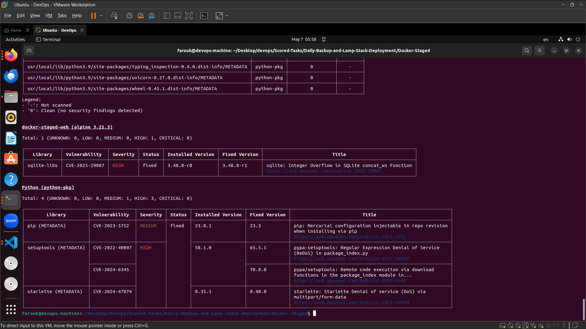
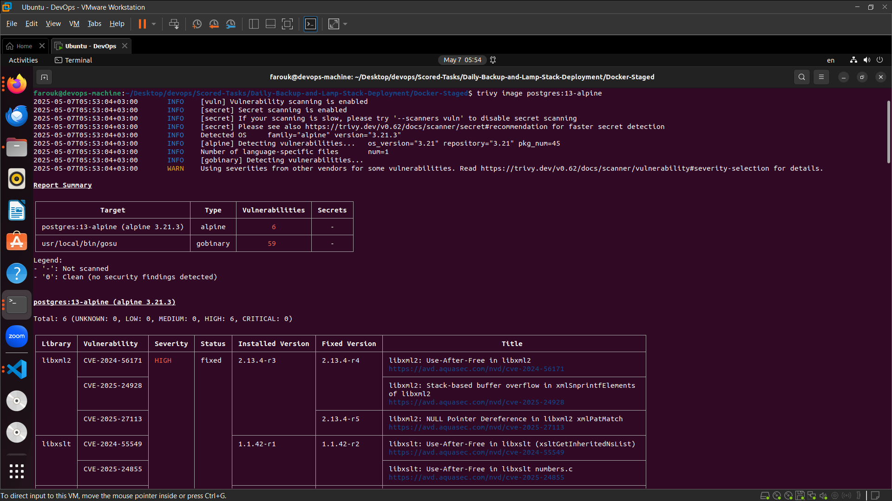
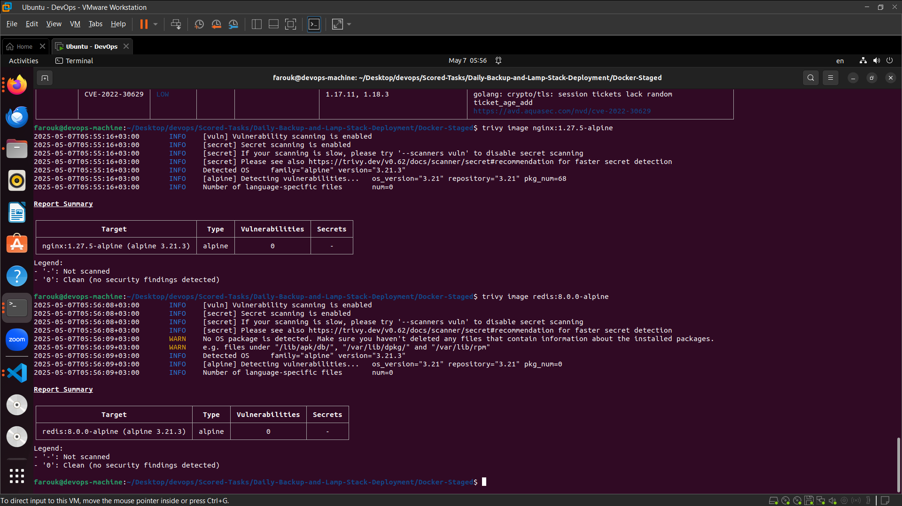

# Production-Ready Containerized Web Application


A production-grade containerized web application built with **FastAPI**, **PostgreSQL**, **Redis**, and **Nginx**, orchestrated via Docker Compose. Designed for efficiency, security, and scalability.


## Features

- 🐍 **FastAPI** backend with asynchronous support
- 🐘 **PostgreSQL** database for persistent storage
- 🧠 **Redis** for caching and session management
- 🔒 **Nginx** reverse proxy with TLS termination (SSL-ready)
- 🐳 **Docker Compose** for multi-container orchestration
- 🚀 **Multi-stage Dockerfile** for optimized builds
- 📦 **Alpine-based images** to minimize container size
- ✅ **Security scans** integrated with Trivy

## Project Structure

├── app/  
│ └── main.py # FastAPI application entrypoint  
├── nginx/  
│ └── nginx.conf # Nginx configuration  
├── Security-Results/ # Trivy vulnerability scan reports  
│ ├── nginx-and-redis-trixy.png  
│ ├── postgres-trixy.png  
│ └── staged-fast-api-trixy.png  
├── docker-compose.yml # Multi-service orchestration  
├── Dockerfile # Multi-stage build for FastAPI  
└── requirements.txt # Python dependencies  


## Security Scan Results

Trivy vulnerability reports for all components:

| Component       | Scan Report                              |
|-----------------|------------------------------------------|
| FastAPI Service |  |
| PostgreSQL      |      |
| Nginx & Redis   |  |

## Quick Start

1. Set up Docker's apt repository.
   ```bash
   sudo apt-get update
   sudo apt-get install ca-certificates curl
   sudo install -m 0755 -d /etc/apt/keyrings
   sudo curl -fsSL https://download.docker.com/linux/ubuntu/gpg -o /etc/apt/keyrings/docker.asc
   sudo chmod a+r /etc/apt/keyrings/docker.asc
    
   echo \
     "deb [arch=$(dpkg --print-architecture) signed-by=/etc/apt/keyrings/docker.asc] https://download.docker.com/linux/ubuntu \
     $(. /etc/os-release && echo "${UBUNTU_CODENAME:-$VERSION_CODENAME}") stable" | \
     sudo tee /etc/apt/sources.list.d/docker.list > /dev/null
   sudo apt-get update
   ```
2.Install the Docker packages.
 ```bash
 sudo apt-get install docker-ce docker-ce-cli containerd.io docker-buildx-plugin docker-compose-plugin
 ```
3. Verify Docker
 ```bash
 sudo docker run hello-world
 ```
4. Run docker composer
```bash
docker compose up -d
```

## Health Check Endpoints
The application includes built-in test endpoints:

### 1. Service Health (GET /)

```bash
curl http://localhost:8000
```
Response Body:

```json
{
  "message": "Welcome to the FastAPI application!"
}
```
### 2. Redis Test (GET /redis)

```bash
curl http://localhost:8000/redis
```
Response Body:

```json
{
  "redis_value": "Hello from Redis!"
}
```
### 3. PostgreSQL Test (GET /postgres)


```bash
curl http://localhost:8000/postgres
```
Response Body:

```json
{
  "postgres_status": "Connected successfully",
  "version": "PostgreSQL 13.20 on x86_64-pc-linux-musl, compiled by gcc (Alpine 14.2.0) 14.2.0, 64-bit"
}
```
